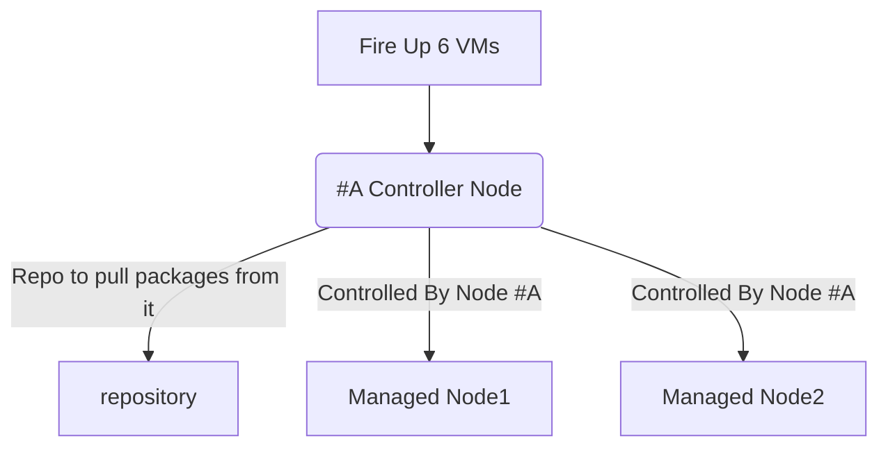

# Practice Exam for RHCSA-EX200

This is a sample of RHCSA-EX200 exam that I’ve created to prepare for my exam. As with the real exam, no perfect answers to the sample exam questions will be provided, but more or less correct and accurate. Remember you want to cover all topics first before start dealing with questions.

## Requirements

There are 18 questions in total could be more or less.
You will be given 2 RHEL 8 virtual machines which you need to configure properly to be able to successfully complete all questions and pass the exam.

One VM will be configured as an Server-A and another would be Server-B. there will be a repository VM which will enable you to install packages to your VMs. The following FQDNs will be used throughout the sample exam.

| FQDN                        | Description | IP Addresses   | Network mask  |
| --------------------------- | ----------- | -------------- | ------------- |
| node1.domain250.example.com | node1       | 172.25.250.100 | 255.255.255.0 |
| node2.domain250.example.com | node2       | 172.25.250.101 | 255.255.255.0 |

## Lab Setup

> you can create the lab setup manually, but instead i've `Vagrantfile` which you can use inorder to create this setup, please go to this website for more information regarding lab setup https://github.com/rdbreak/rhcsa8env
